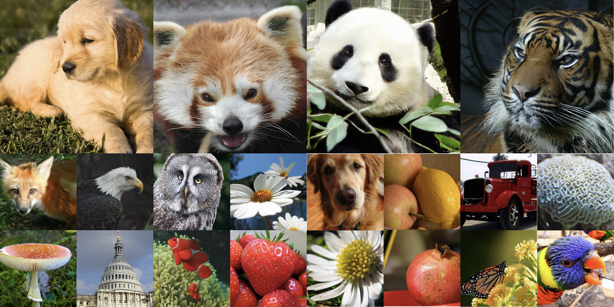

# Persistence Forcing：Exploiting Feature Specialization in Pixel-Space Diffusion

*[Chong Wang](https://scholar.google.com/citations?user=QlZK_hQAAAAJ&hl=zh-CN)¹, [Zixuan Fu](https://scholar.google.com/citations?user=iWALaSYAAAAJ&hl=zh-CN)¹, [Shiqi Huang](https://scholar.google.com/citations?user=rHPXYB0AAAAJ&hl=en)¹, [Siyuan Yang](https://siyuan9446.github.io/)², [Hao Cheng](https://scholar.google.com/citations?user=7Bv4y4YAAAAJ&hl=zh-CN)³, [Bihan Wen](https://personal.ntu.edu.sg/bihan.wen/)¹*<br>
¹Nanyang Technological University    ²KTH Royal Institute of Technology    ³Hebei University of Technology

[](https://chongwang1024.github.io/PerF/)[](https://huggingface.co/ChongWang1024/PerF)



## Introduction

This is the PyTorch implementation of **Persistence Forcing: Exploiting Feature Specialization in Pixel-Space Diffusion**.

PerF exploits the persistent–active feature organization that emerges under heterogeneous refinement. **Persistent-to-Active Conditioning (P-to-A Cond.)** allows persistent features to guide active refinement, while **Persistence Guidance (PG)** strengthens their contribution during sampling.

## Dataset

Download the [ImageNet](https://image-net.org/download) dataset and place it in your `IMAGENET_PATH`:

## Installation

Download the code:

```bash
git clone https://github.com/ChongWang1024/PerF.git
cd PerF
```

Create the environment of `perf`:

```bash
conda env create -f environment.yaml
conda activate perf
```

## Training

Example command for training PerF-B/16 on ImageNet 256x256 for 600 epochs:

```bash
python -m torch.distributed.run --standalone --nproc_per_node=8 \
main_perf.py \
--model PerF-B/16 --proj_dropout 0.0 \
--P_mean -0.8 --P_std 0.8 --noise_scale 1.0 \
--label_drop_prob 0.1 --p_to_a_dropout 0.1 \
--batch_size 128 --blr 5e-5 \
--epochs 600 --warmup_epochs 5 \
--irepa_earlystop 100 --irepa_weight 0.1 \
--output_dir "${OUTPUT_DIR}" --data_path "${IMAGENET_PATH}"
```

Example command for training PerF-L/16 on ImageNet 256x256 for 600 epochs:

```bash
python -m torch.distributed.run --standalone --nproc_per_node=8 \
main_perf.py \
--model PerF-L/16 --proj_dropout 0.0 \
--P_mean -0.8 --P_std 0.8 --noise_scale 1.0 \
--label_drop_prob 0.1 --p_to_a_dropout 0.1 \
--batch_size 128 --blr 5e-5 \
--epochs 600 --warmup_epochs 5 \
--irepa_earlystop 100 --irepa_weight 0.1 \
--output_dir "${OUTPUT_DIR}" --data_path "${IMAGENET_PATH}"
```

Example command for training PerF-H/16 on ImageNet 256x256 for 600 epochs:

```bash
python -m torch.distributed.run --standalone --nproc_per_node=8 \
main_perf.py \
--model PerF-H/16 --proj_dropout 0.2 \
--P_mean -0.8 --P_std 0.8 --noise_scale 1.0 \
--label_drop_prob 0.1 --p_to_a_dropout 0.1 \
--batch_size 128 --blr 5e-5 \
--epochs 600 --warmup_epochs 5 \
--irepa_earlystop 100 --irepa_weight 0.1 \
--output_dir "${OUTPUT_DIR}" --data_path "${IMAGENET_PATH}"
```

Example command for training PerF-H/32 on ImageNet 512x512 for 600 epochs:

```bash
python -m torch.distributed.run --standalone --nproc_per_node=8 \
main_perf.py \
--model PerF-H/32 --proj_dropout 0.2 \
--P_mean -0.8 --P_std 0.8 --noise_scale 2.0 \
--label_drop_prob 0.1 --p_to_a_dropout 0.1 \
--batch_size 128 --blr 5e-5 \
--epochs 600 --warmup_epochs 5 \
--irepa_earlystop 100 --irepa_weight 0.1 \
--output_dir "${OUTPUT_DIR}" --data_path "${IMAGENET_PATH}"
```

To resume training, append `--resume "${OUTPUT_DIR}"`

## Checkpoints

Pretrained models are available on [Hugging Face](https://huggingface.co/ChongWang1024/PerF).


| Dataset          | Model     | Hugging Face |
| ---------------- | --------- | ------------ |
| ImageNet 256x256 | PerF-B/16 | [Download](https://huggingface.co/ChongWang1024/PerF/resolve/main/perf-b16-256/checkpoint-last.pth) |
| ImageNet 256x256 | PerF-L/16 | [Download](https://huggingface.co/ChongWang1024/PerF/resolve/main/perf-l16-256/checkpoint-last.pth) |
| ImageNet 256x256 | PerF-H/16 | [Download](https://huggingface.co/ChongWang1024/PerF/resolve/main/perf-h16-256/checkpoint-last.pth) |
| ImageNet 512x512 | PerF-H/32 | [Download](https://huggingface.co/ChongWang1024/PerF/resolve/main/perf-h32-512/checkpoint-last.pth) |


## Evaluation

Evaluate PerF-B/16 on ImageNet 256x256:

```bash
python -m torch.distributed.run --standalone --nproc_per_node=8 \
main_perf.py \
--model PerF-B/16 --img_size 256 --noise_scale 1.0 \
--gen_bsz 256 --num_images 50000 \
--cfg 2.8 --pg 3.0 \
--cfg_interval_min 0.1 --cfg_interval_max 1.0 \
--pg_interval_min 0.0 --pg_interval_max 1.0 \
--sampling_method heun --num_sampling_steps 50 \
--evaluate_gen \
--output_dir ${CKPT_DIR} --resume ${CKPT_DIR} \
--data_path ${IMAGENET_PATH}
```

Evaluate PerF-H/16 on ImageNet 256x256:

```bash
python -m torch.distributed.run --standalone --nproc_per_node=8 \
main_perf.py \
--model PerF-H/16 --img_size 256 --noise_scale 1.0 \
--gen_bsz 256 --num_images 50000 \
--cfg 3.0 --pg 1.9 \
--cfg_interval_min 0.1 --cfg_interval_max 1.0 \
--pg_interval_min 0.0 --pg_interval_max 1.0 \
--sampling_method heun --num_sampling_steps 50 \
--evaluate_gen \
--output_dir ${CKPT_DIR} --resume ${CKPT_DIR} \
--data_path ${IMAGENET_PATH}
```

Evaluate PerF-H/32 on ImageNet 512x512:

```bash
python -m torch.distributed.run --standalone --nproc_per_node=8 \
main_perf.py \
--model PerF-H/32 --img_size 512 --noise_scale 2.0 \
--gen_bsz 256 --num_images 50000 \
--cfg 2.9 --pg 2.0 \
--cfg_interval_min 0.1 --cfg_interval_max 1.0 \
--pg_interval_min 0.0 --pg_interval_max 1.0 \
--sampling_method heun --num_sampling_steps 50 \
--evaluate_gen \
--output_dir ${CKPT_DIR} --resume ${CKPT_DIR} \
--data_path ${IMAGENET_PATH}
```


## Acknowledgements

This code builds on [JiT](https://github.com/LTH14/JiT), with core layer references to [SiT](https://github.com/willisma/SiT) and [Lightning-DiT](https://github.com/hustvl/LightningDiT).
